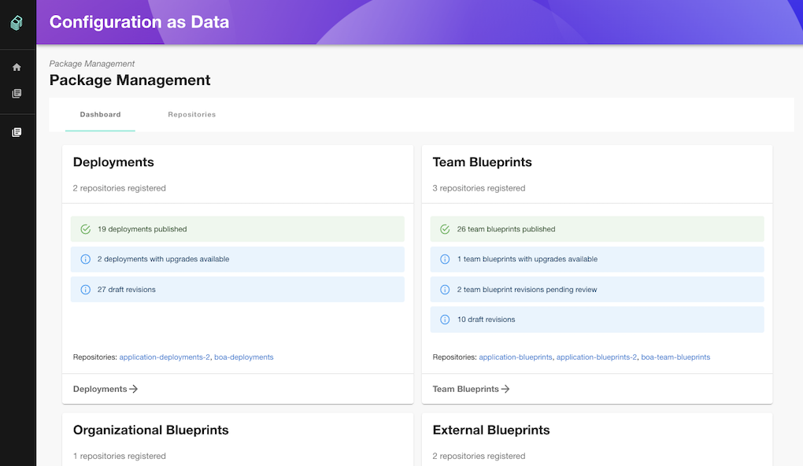

# Kpt Backstage Plugins

Welcome! This repository contains the Kpt Backstage Plugins. The plugins can be
installed into an existing Backstage Application following the READMEs for each
plugin. For development and testing, the plugins can also be executed with the
example Backstage Application in this repository.

[Configuration as Data](plugins/cad) is the primary plugin which powers the
WYSIWYG Configuration GUI over GitOps using [kpt](https://kpt.dev/) and its new
Package Orchestrator,
[Porch](https://github.com/GoogleContainerTools/kpt/tree/main/porch).



_New to kpt?_

kpt is a package-centric toolchain that enables a WYSIWYG configuration
authoring, automation, and delivery experience, which simplifies managing
Kubernetes platforms and KRM-driven infrastructure at scale by manipulating
declarative Configuration as Data, separated from the code that transforms it.
Read [kpt.dev](https://kpt.dev/) to learn more.

_New to Backstage?_

Backstage is an open platform for building developer portals. Watch
[What is Backstage? (Explainer Video) on YouTube](https://www.youtube.com/watch?v=85TQEpNCaU0)
and read [backstage.io](https://backstage.io) to learn more.

## Quick Start

### Prerequisites

To use the Backstage Application in this repository, you will need:

- [Node.js](https://nodejs.org/)
  [Active LTS Release](https://nodejs.org/en/about/releases/) installed
- [yarn](https://classic.yarnpkg.com/en/docs/install) installed
- [git](https://github.com/git-guides/install-git) installed
- [Porch (Package Orchestration Server)](https://kpt.dev/guides/porch-installation)
  installed on a Kubernetes cluster

### Clone Repository

The first step is to check out the code to your local development environment.
We recommend you
[create your own fork](https://docs.github.com/en/get-started/quickstart/fork-a-repo),
but we will keep things simple here.

```bash
git clone https://github.com/GoogleContainerTools/kpt-backstage-plugins.git
cd kpt-backstage-plugins
```

### Install Dependencies

You'll need to install dependencies before you can run the UI locally.

```bash
yarn install
```

### Running the UI

To run the UI, you'll need to use this command will start Backstage frontend and
backend instances. The frontend instance is hosted on port 3000 and, the backend
instance is on port 7007. Once started, you'll be able to access the UI by
browsing to the URL http://localhost:3000.

```bash
yarn dev
```

### Executing Tests

Run tests:

```bash
yarn test
```

### Executing Linter

Run the linter:

```bash
yarn lint
```

### Executing Code Formatting

Run the code formatter:

```bash
yarn prettier:check # Checks for any code formatting errors
yarn prettier:write # Formats code
```

## Contributing

If you are interested in contributing, please start with the
[contribution guidelines](CONTRIBUTING.md).
